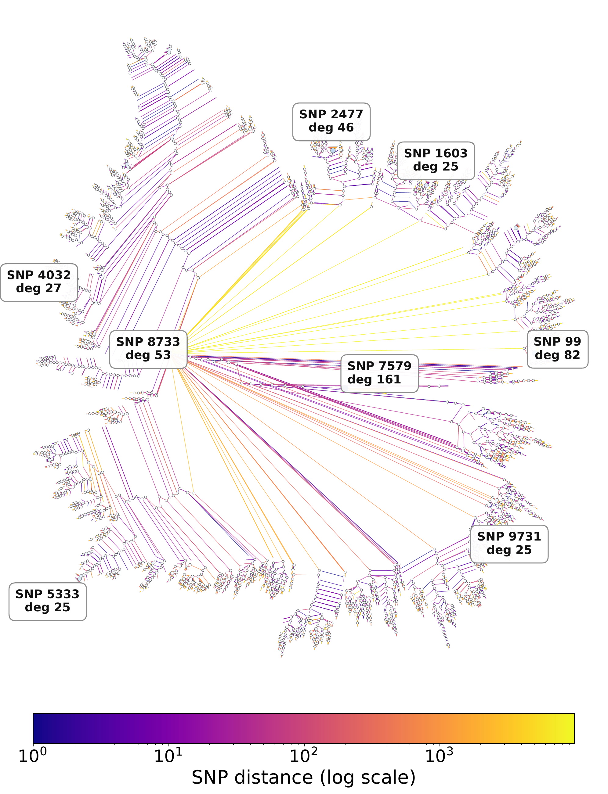

# GPC: An expressive and tractable deep generative model for genetic variation data

<p align="center">
  
</p>

**GPC** (Genetic Probabilistic Circuit) is a tractable deep generative model for haplotype data. It supports exact likelihood evaluation, exact marginalisation, and fast conditional queries — so the *same* trained model can generate artificial genomes, impute missing SNPs, and be audited for privacy without retraining.

Preprint: [GPC: An expressive and tractable deep generative model for genetic variation data (bioRxiv, 2026)](https://www.biorxiv.org/content/10.1101/2023.05.16.541036v3).

---

## Installation

```bash
pip install pyjuice

git clone https://github.com/sriramlab/GPC.git
cd GPC
```

Requires a CUDA-capable GPU, PyTorch, NumPy, pandas, scikit-learn, networkx, matplotlib, and tqdm. GPC is built on [PyJuice](https://github.com/Tractables/pyjuice).

---

## Data format

A whitespace-separated `0/1` haplotype file: rows = haplotypes, columns = SNPs.

Optionally, a `.legend` file with header `id position a0 a1` (space-separated) giving the bp position of each SNP. If supplied, LD plots use bp distance on the x-axis.

`pc/demo/` ships two files from a contiguous chr15 region in 1000 Genomes Project Phase 3 (5008 haplotypes):

| File | SNPs | Use for |
|---|---|---|
| `1K_full.txt` + `1K_full.legend`   | 1,000  | default — fast end-to-end run |
| `10K_full.txt` + `10K_full.legend` | 10,000 | full run |

---

## Quick start (1K SNPs, ~ a few minutes on one GPU)

From `pc/demo/`, run the four steps in order. Every script shares one `--run-dir` (default `out/1K`).

```bash
cd pc/demo

# 1. Train a GPC with train/val/test split and early stopping.
python3 train_demo.py

# 2. Sample artificial genomes from the best checkpoint.
python3 generate_demo.py

# 3. Evaluate sample quality + privacy: PCA, LD decay, LD error, CLT tree, AATS.
python3 evaluate.py

# 4. Imputation benchmark: single-SNP + multi-SNP at 30/50/80% missingness.
python3 impute_demo.py
python3 plot_imputation.py
```

Afterwards `out/1K/` contains:

```
out/1K/
├── config.json
├── gpc_best.jpc                   best-val GPC checkpoint
├── train.txt / val.txt / test.txt shuffled splits (reused downstream)
├── train.log                      per-epoch train/val LL
├── samples.txt                    generated haplotypes
├── quality/                       pca, ld_decay, ld_error, clt_tree, clt_summary
├── imputation/                    r2 CSVs + imputation_r2.pdf + imputation_summary.csv
└── privacy/                       aats
```

All scripts take `--help`.

## Full run (10K SNPs)

Same four steps, bigger model:

```bash
cd pc/demo

python3 train_demo.py      --data 10K_full.txt --output-dir out/10K \
    --latents 128 --epochs 2000 --patience 100 --seed 1
python3 generate_demo.py   --run-dir out/10K --num-samples 5008 --seed 1
python3 evaluate.py        --run-dir out/10K --legend 10K_full.legend --seed 1
python3 impute_demo.py     --run-dir out/10K --mask-rates 0.3 0.5 0.8 --seed 1
python3 plot_imputation.py --run-dir out/10K
```

## Using your own data

```bash
python3 train_demo.py --data path/to/haps.txt --output-dir out/my_run \
    --latents 128 --epochs 2000 --patience 100 --seed 1
python3 generate_demo.py   --run-dir out/my_run
python3 evaluate.py        --run-dir out/my_run --legend path/to/haps.legend
python3 impute_demo.py     --run-dir out/my_run
python3 plot_imputation.py --run-dir out/my_run
```

Pass `--legend ''` to `evaluate.py` to fall back to SNP-index distance when no legend is available.

---

## Repository layout

```
pc/demo/          self-contained demo (start here)
pc/               training / sampling / imputation scripts used in the paper
plots/            analysis notebooks and figure-generating scripts for the paper
aux/              SNP legends, MAF tables, AATS utilities
results/          per-dataset outputs (checkpoints, samples, metrics)
```

`plots/structure/` adopts and extends code from Yelmen et al., *Deep convolutional and conditional neural networks for large-scale genomic data generation* ([PLOS Comput. Biol.](https://journals.plos.org/ploscompbiol/article?id=10.1371/journal.pcbi.1011584)).

---

## Citation

```
@article{anand2026gpc,
  title   = {GPC: An expressive and tractable deep generative model for genetic variation data},
  author  = {Anand, Prateek and Liu, Anji and Dang, Meihua and Fu, Boyang and Wei, Xinzhu and Van den Broeck, Guy and Sankararaman, Sriram},
  journal = {bioRxiv},
  year    = {2026},
  doi     = {10.1101/2023.05.16.541036},
  url     = {https://www.biorxiv.org/content/10.1101/2023.05.16.541036v3}
}
```
